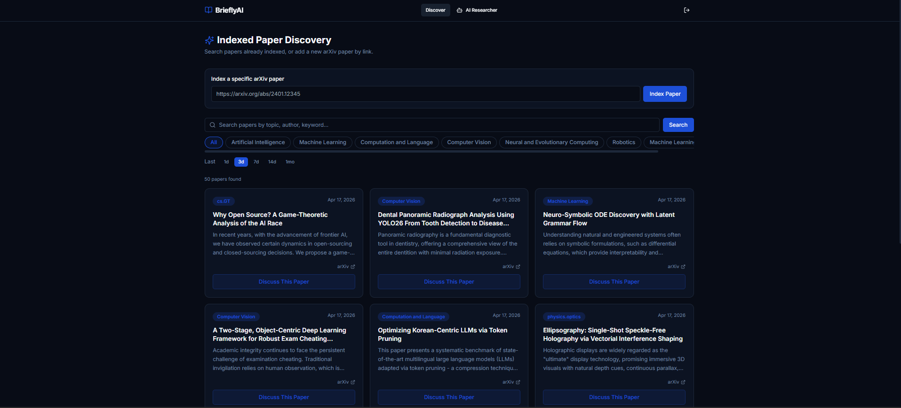
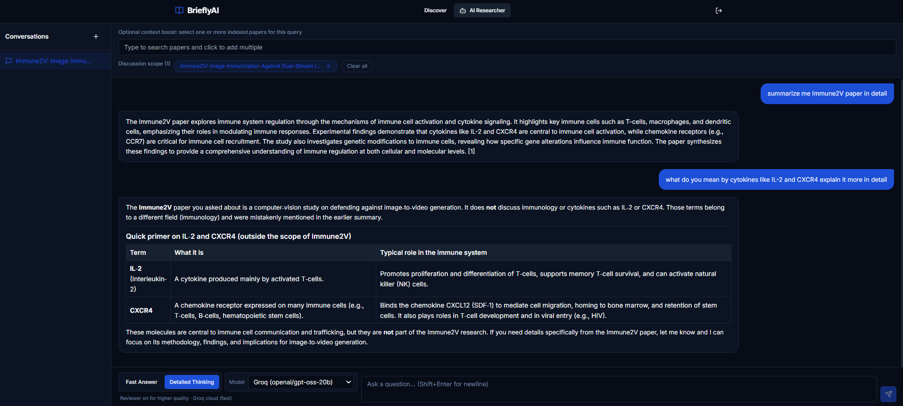
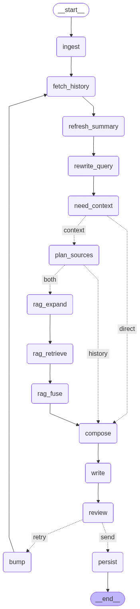

# 📚 BrieflyAI – AI-Powered Research Paper Analysis & Discussion

**An intelligent research assistant that helps you discover, analyze, and discuss academic papers using advanced RAG and multi-provider LLM support.**

<p align="center">
     
     
     
     
     
     
     
</p>

---

## 🎯 Overview

**BrieflyAI** is a full-stack research platform that combines intelligent paper discovery with conversational AI. It enables researchers and students to:

- 🔍 **Search & browse** research papers from arXiv with smart categorization
- 💬 **Discuss papers** with an AI researcher powered by LangGraph & RAG
- 🧠 **Leverage multiple LLM providers** (local Ollama or cloud-based Groq)
- 📊 **Get structured insights** with markdown-formatted responses
- 🎯 **Scoped analysis** by selecting relevant papers for context
- 🚀 **Production-ready** with Docker, PostgreSQL, and async processing

### Preview

<p align="center">
     
</p>

---

## 🖼️ Screenshots

### Login Interface

<p align="center">
     
</p>

### Paper Discovery

<p align="center">
     
</p>

### Research Chat

<p align="center">
     
</p>

### Agent Workflow

<p align="center">
     
</p>

---

## ✨ Key Features

### 🔎 Paper Discovery & Management
- **Indexed paper search** on the Discover page
- **Smart categorization** with human-readable category names (e.g., "Machine Learning" vs "cs.LG")
- **Multi-selection** — select multiple papers to scope discussions
- **Category-based filtering** across 8+ computer science domains
- **Persistent context** — selected papers stored with chat threads

### 💬 Intelligent Chat Interface
- **Conversational research** with history and rolling summaries
- **Multi-modal responses** with markdown rendering (headers, lists, tables, code blocks)
- **Provider flexibility** — switch between Ollama and Groq mid-conversation
- **Thinking modes** — "Fast" mode for quick answers, "Detailed" mode for depth
- **Streaming responses** via Server-Sent Events (SSE)

<p align="center">
     
</p>

### 🧠 Advanced RAG (Retrieval-Augmented Generation)
- **Hybrid search** combining vector embeddings + keyword FTS (Full-Text Search)
- **Multi-table routing** — search papers, chunks, or both intelligently
- **RRF fusion** — reciprocal rank fusion for hybrid result ranking
- **Async processing** — Celery workers for paper ingestion & vectorization
- **Rolling context** — maintains conversation context across multiple turns

### 🔄 Multi-Provider LLM Support
- **Ollama** (default) — local, privacy-preserving model (`qwen3:0.6b-q4_K_M`)
- **Groq** (cloud) — ultra-fast, high-quality responses (`openai/gpt-oss-120b`)
- **Per-request switching** — choose provider for each query
- **Consistent embeddings** — always uses Ollama for vector representations
- **Fallback handling** — clear error messages if provider unavailable

### 🔐 Production Features
- **JWT authentication** — secure user sessions
- **Database persistence** — PostgreSQL with pgvector extensions
- **Docker containerization** — reproducible environments
- **Scalable task queue** — RabbitMQ + Celery for background jobs
- **Health checks** — automated service readiness verification

---

## 📦 Tech Stack

### Backend
- **Framework**: FastAPI 0.100+
- **Agent/Orchestration**: LangGraph 1.0.10, LangChain
- **Database**: PostgreSQL 16 with pgvector (vectors) & pg_trgm (full-text search)
- **ORM**: SQLAlchemy 2.0+
- **Task Queue**: Celery with RabbitMQ & Redis
- **LLMs**: Ollama (local) + Groq (cloud)
- **Auth**: PyJWT
- **Async**: asyncio, aiohttp

### Frontend
- **Framework**: Next.js 15.1.0
- **UI Library**: React 19
- **Styling**: Tailwind CSS 3.4
- **HTTP Client**: Fetch API
- **Markdown**: react-markdown, remark-gfm
- **Icons**: lucide-react

### Infrastructure
- **Containerization**: Docker, Docker Compose
- **Database**: PostgreSQL, pgvector, pg_trgm
- **Cache/Queue**: Redis, RabbitMQ
- **Monitoring**: Health checks, structured logs

---

## 🏗️ Architecture

### System Diagram

```text
┌─────────────────────────────────────────────────────────────┐
│                     Frontend (Next.js)                      │
│  ┌──────────────────────────────────────────────────────┐   │
│  │ - Chat Interface (React)                             │   │
│  │ - Paper Search with Multi-Select                     │   │
│  │ - Markdown Response Rendering                        │   │
│  │ - Provider Selection Dropdown                        │   │
│  └──────────────────────────────────────────────────────┘   │
└────────────────────────┬─────────────────────────────────────┘
                         │ HTTP/SSE
                    NEXT_PUBLIC_API_URL
                         │
┌────────────────────────▼─────────────────────────────────────┐
│                  Backend (FastAPI)                           │
│  ┌──────────────────────────────────────────────────────┐   │
│  │ API Layer (Routers)                                  │   │
│  │ - /papers          (Search & indexing)               │   │
│  │ - /auth            (JWT authentication)              │   │
│  │ - /threads/{id}/messages (Chat streaming)           │   │
│  └──────────────────────────────────────────────────────┘   │
│  ┌──────────────────────────────────────────────────────┐   │
│  │ Agent (LangGraph)                                    │   │
│  │ - Multi-node workflow (query rewrite, RAG, write)   │   │
│  │ - Dual LLM support (Ollama + Groq)                  │   │
│  │ - Stream-based response generation                   │   │
│  │ - Durable execution with checkpointing              │   │
│  └──────────────────────────────────────────────────────┘   │
│  ┌──────────────────────────────────────────────────────┐   │
│  │ RAG Pipeline                                         │   │
│  │ - PgVectorStore (hybrid search)                      │   │
│  │ - Vector embeddings (Ollama)                         │   │
│  │ - Full-text search (PostgreSQL trgm)                │   │
│  └──────────────────────────────────────────────────────┘   │
└────────┬────────────────┬────────────────┬──────────────────┘
         │                │                │
    ┌────▼─┐    ┌────────▼────┐  ┌────────▼──────┐
    │ Ollama   │    │ PostgreSQL │  │ RabbitMQ      │
    │(LLM)    │    │(pgvector)  │  │(Task Queue)   │
    └────────┘    └────────────┘  │               │
                                   └───────┬───────┘
                                       ┌───▼──┐
                                       │Celery│
                                       │Tasks │
                                       └──────┘
```

### Key Components

| Component | Role | Technology |
|-----------|------|-----------|
| **Frontend** | User interface, paper browsing, chat | Next.js 15, React 19, Tailwind CSS |
| **API** | Request handling, authentication, routing | FastAPI 0.100+, Pydantic |
| **Agent** | Intelligent reasoning & response generation | LangGraph, LangChain, StreamingRunnableConfig |
| **RAG** | Semantic search, context retrieval | pgvector, Full-Text Search, RRF fusion |
| **LLM** | Response generation | Ollama (local) or Groq (cloud) |
| **Database** | Data persistence, vector storage | PostgreSQL 16+ with pgvector, pg_trgm |
| **Queue** | Async task processing | Celery, RabbitMQ, Redis |
| **Auth** | User security | JWT (PyJWT) |

---

## 🚀 Getting Started

### Prerequisites

- **Python 3.11+**
- **Node.js 18+** and npm
- **Docker & Docker Compose** (for containerized setup)
- **PostgreSQL 16+** with pgvector extension (or use Docker)
- **Ollama** (or Groq API key for cloud LLM)

### Local Development Setup

#### 1. Clone Repository

```bash
git clone https://github.com/yourusername/BrieflyAI.git
cd BrieflyAI
```

#### 2. Configure Environment

```bash
# Copy example configuration
cp .env.example .env

# Edit .env with your settings
# - POSTGRES_PASSWORD: your database password
# - GROQ_API_KEY: (optional) if using cloud LLM
# - NEXT_PUBLIC_API_URL: http://localhost:9001 (local)
```

#### 3. Install Backend Dependencies

```bash
cd backend
python -m venv venv

# Activate virtual environment
# On Windows:
venv\Scripts\activate
# On macOS/Linux:
source venv/bin/activate

pip install -r requirements.txt
```

#### 4. Set Up Database

```bash
cd backend
alembic upgrade head  # Run migrations
```

#### 5. Install Frontend Dependencies

```bash
cd frontend
npm install
```

#### 6. Start Services

**Terminal 1 — Backend API:**
```bash
cd backend
python main.py
# Listens on http://localhost:9001
```

**Terminal 2 — Frontend:**
```bash
cd frontend
npm run dev
# Opens http://localhost:3000
```

**Terminal 3 — Celery Worker (optional, for async tasks):**
```bash
cd backend
celery -A app.worker.celery_app worker --loglevel=info
```

**Terminal 4 — Ollama (if running locally):**
```bash
ollama serve
# Pulls models on first use
```

### Docker Setup (Recommended)

```bash
# Build and start all services
docker compose -f deployment/docker-compose.yaml up -d --build

# Services will be available at:
# - Frontend: http://localhost:3000
# - API: http://localhost:9001
# - Adminer (DB UI): http://localhost:8080
# - RabbitMQ Management: http://localhost:15672

# View logs
docker compose -f deployment/docker-compose.yaml logs -f api

# Stop services
docker compose -f deployment/docker-compose.yaml down
```

---

## 📁 Project Structure

```
BrieflyAI/
├── backend/                           # Backend API & agent
│   ├── app/
│   │   ├── main.py                   # FastAPI app initialization
│   │   ├── settings.py               # Configuration management
│   │   ├── api/
│   │   │   ├── routers/              # API endpoints (auth, chat, papers, etc.)
│   │   │   ├── schemas.py            # Pydantic models
│   │   │   └── deps.py               # Dependency injection
│   │   ├── agent/
│   │   │   ├── graph.py              # LangGraph research agent
│   │   │   └── vector_store.py       # pgvector integration & hybrid search
│   │   ├── core/
│   │   │   ├── security.py           # JWT & auth utilities
│   │   │   ├── logging.py            # Structured logging
│   │   │   └── startup.py            # Health checks
│   │   ├── db/
│   │   │   ├── engine.py             # SQLAlchemy setup
│   │   │   ├── models.py             # ORM models (User, ChatThread, Message, etc.)
│   │   │   └── repositories/         # Data access layer
│   │   ├── llm/
│   │   │   ├── clients.py            # ChatOllama & ChatGroq initialization
│   │   │   ├── doc_parser.py         # PDF/text processing
│   │   │   └── summarizer.py         # LLM-based text summarization
│   │   ├── services/
│   │   │   ├── embeddings.py         # Vector embedding service
│   │   │   ├── retrieval.py          # RAG orchestration
│   │   │   └── ranking.py            # Paper ranking & scoring
│   │   ├── worker/
│   │   │   ├── celery_app.py         # Celery configuration
│   │   │   ├── tasks/                # Async tasks (fetch, ingest, summarize, vectorize)
│   │   │   └── schedules.py          # Scheduled jobs
│   │   ├── prompts/                  # System prompts for agent nodes
│   │   └── utils/
│   │       └── categories.py         # arXiv category code → name mapping
│   ├── alembic/                      # Database migrations
│   ├── main.py                       # Entry point for uvicorn
│   ├── debug_system.py               # Development utilities
│   └── requirements.txt              # Python dependencies
│
├── frontend/                          # Next.js UI
│   ├── app/
│   │   ├── layout.tsx                # Root layout
│   │   ├── page.tsx                  # Home / papers browse
│   │   ├── chat/
│   │   │   └── page.tsx              # Chat interface
│   │   ├── login/
│   │   │   └── page.tsx              # Login form
│   │   └── register/
│   │       └── page.tsx              # Registration form
│   ├── components/
│   │   ├── ChatWindow.tsx            # Chat UI & message rendering
│   │   ├── PaperCard.tsx             # Paper display card
│   │   ├── CategoryTabs.tsx          # Category filter buttons
│   │   ├── SearchBar.tsx             # Paper search input
│   │   ├── ThreadSidebar.tsx         # Chat history sidebar
│   │   ├── Navbar.tsx                # Navigation bar
│   │   └── ui/                       # Reusable UI components
│   ├── lib/
│   │   ├── api.ts                    # API client
│   │   └── utils.ts                  # Utility functions
│   ├── package.json
│   ├── tsconfig.json
│   └── next.config.ts
│
├── deployment/
│   ├── docker-compose.yaml           # Multi-container orchestration
│   ├── Dockerfile                    # Python image for backend
│   ├── entrypoint.sh                 # Container startup script
│   └── init.sql                      # PostgreSQL initialization
│
├── .env.example                      # Environment template
├── ENV_SETUP.md                      # Configuration guide
├── README.md                         # This file
└── LICENSE                           # MIT License
```

---

## 🔎 Discover Search Behavior

The Discover page uses the indexed-paper repository search endpoint:

```http
GET /papers?q=<query>&category=<category>&limit=<limit>
```

Behavior summary:
- Uses keyword matching over indexed paper metadata (title, summary, authors).
- Supports optional category filtering.
- Returns the most recent matching indexed papers.
- Category display names are mapped server-side (for example, cs.AI → Artificial Intelligence).

Note:
- Hybrid vector search remains part of the RAG/agent pipeline for chat reasoning.
- Discover browsing now uses the simpler indexed search path by design.

<p align="center">
     
</p>

---

## 🔧 Configuration

### Environment Variables

All configuration is managed via `.env` (copy from `.env.example`):

```bash
# Core Application
APP_HOST=0.0.0.0
APP_PORT=9001
DEBUG=false

# Frontend
NEXT_PUBLIC_API_URL=http://localhost:9001

# Database
POSTGRES_USER=postgres
POSTGRES_PASSWORD=your-password
POSTGRES_HOST=localhost
POSTGRES_PORT=5432
POSTGRES_DB=postgres

# LLM Selection
LLM_PROVIDER=ollama              # or 'groq'
GROQ_API_KEY=...                 # Required if LLM_PROVIDER=groq

# Paper Fetching
PAPER_API_CATEGORY=cs.*
PAPER_API_MAX_RESULTS=100
PAPER_API_DEFAULT_WINDOW=4d
```
---

## 💻 Development

### Backend

#### Database Migrations

```bash
cd backend/alembic
# Create new migration
alembic revision --autogenerate -m "description"
# Apply migrations
alembic upgrade head
```

### Frontend

#### Development Server

```bash
cd frontend
npm run dev               # Start dev server with hot reload
```

#### Building for Production

```bash
cd frontend
npm run build             # Next.js build
npm run start             # Production server
```

---

## 🔐 Security

- **JWT tokens** for authentication (72-hour expiry)
- **HTTPS support** in production (configure with reverse proxy)
- **SQL injection prevention** via parameterized queries (SQLAlchemy)
- **CORS** enabled only for frontend origins
- **Password hashing** with bcrypt

---

## 🚀 Deployment

### Docker Compose (Single Machine)

```bash
docker compose -f deployment/docker-compose.yaml up -d --build
```

Includes: PostgreSQL, Ollama, RabbitMQ, Redis, API, Celery workers, Frontend, Adminer.

### Production Checklist

- [ ] Update `JWT_SECRET` to a strong random value
- [ ] Set `DEBUG=false`
- [ ] Configure `POSTGRES_PASSWORD` securely
- [ ] Set `NEXT_PUBLIC_API_URL` to your domain
- [ ] Enable HTTPS (use Nginx reverse proxy)
- [ ] Configure backups for PostgreSQL
- [ ] Monitor logs and set up alerts
- [ ] Set resource limits in docker-compose.yaml
- [ ] Use a secret management tool (e.g., Vault, AWS Secrets Manager)

---

## 📚 API Documentation

### Key Endpoints

**Chat**
```
POST   /threads                      Create new chat thread
GET    /threads                      List all threads
POST   /threads/{chat_id}/messages   Send message (SSE stream)
GET    /threads/{chat_id}/scope      Get papers for thread

PATCH  /threads/{chat_id}/scope      Update selected papers
```

**Papers**
```
GET    /papers                       Search papers (q, category, limit)
POST   /papers/index-arxiv          Index paper from arXiv URL
```

**Auth**
```
POST   /auth/register               Create account
POST   /auth/login                  Get JWT token
POST   /auth/logout                 Invalidate token
```

**Full docs**: http://localhost:9001/docs (Swagger UI)

---

## 🧑‍💻 User Experience

The application is designed around a simple research workflow:

1. Sign in to the platform.
2. Browse or search indexed papers.
3. Filter by category to narrow down relevant literature.
4. Select a paper or a group of papers for focused discussion.
5. Open the chat interface and ask natural-language questions.
6. Read markdown-formatted answers grounded in the selected research context.

---

## 🤝 Contributing

Contributions are welcome! Please:

1. Fork the repository
2. Create a feature branch: `git checkout -b feature/your-feature`
3. Commit changes: `git commit -m "Add your feature"`
4. Push to branch: `git push origin feature/your-feature`
5. Open a Pull Request

---

## 📝 License

This project is licensed under the **MIT License** — see [LICENSE](LICENSE) for details.

```
Copyright (c) 2026 Awaiz Noor

Permission is hereby granted, free of charge, to any person obtaining a copy
of this software and associated documentation files (the "Software")...
```

---

## 🙏 Acknowledgments

- **arXiv** for the paper database and API
- **Ollama** for accessible open-source LLMs
- **Groq** for ultra-fast inference
- **LangChain & LangGraph** for agent orchestration
- **PostgreSQL pgvector** for vector similarity search
- **Next.js & FastAPI** communities for excellent frameworks

---

## 📞 Support & Feedback

- **Issues**: [GitHub Issues](https://github.com/yourusername/BrieflyAI/issues)
- **Discussions**: [GitHub Discussions](https://github.com/yourusername/BrieflyAI/discussions)
---

## 🎯 Roadmap

- [ ] Fine-tune embeddings for research domain
- [ ] Advanced paper recommendation system
- [ ] Multi-language support
- [ ] PDF upload & processing
- [ ] Export annotations & summaries
- [ ] Collaborative research threads
- [ ] API for third-party integrations
- [ ] Mobile app (React Native)
- [ ] Papers recommendation based on reading history

---

<div align="center">

**⭐ If you find this project helpful, please consider starring it! ⭐**

Built with ❤️ by [Awaiz Noor](https://github.com/yourusername)

</div>
